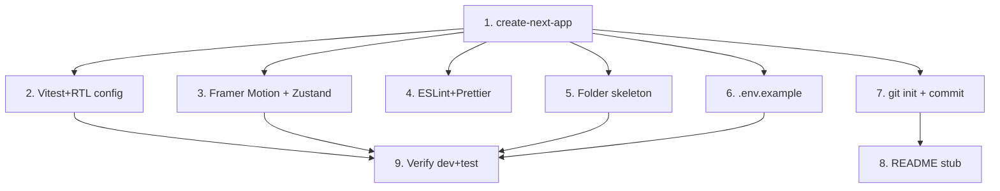

# GR-001: Project scaffolding & tooling

## Description

### Requirement

Stand up a Next.js project with the full toolchain the rest of the specs assume, so every later spec can start from `npm run dev` / `npm test` working. Nothing patient-facing lives here — this is pure infra.

### Design

- Next.js 15, App Router, TypeScript, `src/` directory.
- Tailwind CSS for styling; Framer Motion for animation (installed here, used from GR-006 onward).
- Zustand for form state (installed here, used from GR-003/GR-015 onward).
- Vitest + React Testing Library + `@testing-library/jest-dom` for unit/component tests, configured to run against the App Router (jsdom environment).
- ESLint + Prettier with a single shared config — no per-spec style bikeshedding later.
- Env var handling: `.env.local` (gitignored) holds `GROQ_API_KEY`; `.env.example` is committed with the key name but no value.
- Folder skeleton (empty placeholder files where needed so later specs land in the right place):
  ```
  /app
    /intake
    /review
    /api/parse
  /lib
    /schema
    /engine
    /rules
  /components
    /icons
  /tests
  /specs        (already exists)
  ```
- No database, no auth, no server-side session — confirm this explicitly in the README stub so later specs don't accidentally introduce one.

### Tasks

1. `create-next-app` with TS + Tailwind + App Router + `src/` dir.
2. Install and configure Vitest + RTL (`vitest.config.ts`, jsdom environment, a `tests/setup.ts` that imports `@testing-library/jest-dom`).
3. Install Framer Motion, Zustand.
4. Add ESLint + Prettier config; wire `npm run lint`.
5. Create the folder skeleton above with `.gitkeep`/placeholder index files.
6. Add `.env.example` with `GROQ_API_KEY=`; confirm `.env.local` is in `.gitignore`.
7. Initialize git repo, initial commit.
8. Root `README.md` stub: project name, "no login / no admin panel / no DB by design", how to run dev + test.
9. Verify `npm run dev` serves a blank Next.js page and `npm test` runs (even with zero tests) with exit code 0.

## Task Dependency Graph



Tasks 2–6 are independent of each other and can run in parallel once T1 is done.

## Status

Not Started

## Acceptance Criteria

- [ ] `npm run dev` starts with no errors and serves a page at `/`.
- [ ] `npm test` runs Vitest successfully (zero tests is fine at this stage).
- [ ] `npm run lint` runs with no config errors.
- [ ] `.env.example` exists with `GROQ_API_KEY=`; `.env.local` is gitignored; no secret is committed anywhere in the repo.
- [ ] Folder skeleton from Design exists.
- [ ] Git repo initialized with an initial commit.
- [ ] `README.md` states the no-login/no-admin/no-DB constraint explicitly.
