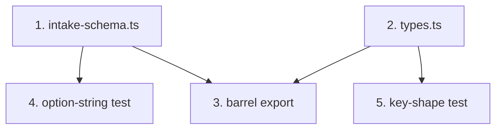

# GR-002: Domain schema & types

## Description

### Requirement

Establish one canonical, typed representation of the 16-question intake (as given in the brief) plus the onboarding fields (name/age/sex) needed to gate Q6/7. This file is the single source of truth every other spec imports from — no spec should redeclare question options or output shape independently.

### Design

**Decisions made here (documented so later specs don't re-litigate them):**

- All `yesno`/`bool`-typed fields serialize as TypeScript `boolean` (`true`/`false`) in the output JSON, not the strings "Yes"/"No" — cleaner for a "structured data" grading pass. UI copy still displays "Yes"/"No" to the patient.
- `single`/`multi`-typed fields serialize as the exact option strings from the brief (verbatim, for graders to string-match against the original schema).
- Female-only questions (Q6, Q7) are **always present as keys** in the output, even for male patients — value defaults to `"Not applicable"` rather than the key being omitted, so the output is always a complete, fixed shape.
- `patient` block (name/age/sex) is additive — not part of the original 16 graded fields, but required for gating and for the doctor's context. `name` is optional and cosmetic only (rule: no real personal data — placeholder/demo names only).

**File: `lib/schema/intake-schema.ts`** — data-driven schema (mirrors the JSON the brief provided almost verbatim) that GR-003's engine reads to derive question order, types, options, and branching flags (`femaleOnly`, `followup`). This is the literal machine-readable schema from the brief, transcribed as a typed TS const — not reinvented.

**File: `lib/schema/types.ts`** — the derived answer/output types:

```ts
export type Sex = "Male" | "Female" | "Prefer not to say";

export interface PatientProfile {
  name?: string;
  age: number;
  sex: Sex;
}

export interface ProductRow {
  row:
    | "OTC/Medicated Shampoos"
    | "Hair Oils/Serums"
    | "Topical Minoxidil"
    | "Oral Minoxidil"
    | "Supplements";
  used: boolean;
  duration: "<3mo" | "3-6mo" | ">6mo" | null;
  helped: boolean | null;
  side_effects: boolean | null;
}

export interface ProcedureRow {
  row: "PRP/GFC/iPRF" | "Stem Cells/Exosomes" | "Hair Transplant" | "Other";
  done: boolean;
  sessions: "1-3" | "4-6" | ">6" | null;
  helped: boolean | null;
}

export interface Habits {
  smoking: boolean;
  smoking_severity:
    "Mild <5/day" | "Moderate 5-10/day" | "Severe >10/day" | null;
  alcohol: boolean;
  hard_water: boolean;
  hair_wash_frequency: "Daily" | "Alternate Days" | "Weekly";
  heating_tools_styling_chemicals: boolean;
  salon_treatments: boolean;
  salon_treatment_detail: string | null;
}

export interface IntakeOutput {
  form: "GenoRoot Hair & Scalp Intake";
  generatedAt: string; // ISO timestamp
  patient: PatientProfile;
  sections: {
    A: {
      age_hair_loss_began: number;
      duration: "Less than 6 months" | "6-12 months" | "Over a year";
      family_history: string[];
      pattern: string[];
    };
    B: {
      diagnosed_conditions: string[];
      menstrual_cycle:
        "Regular" | "Irregular" | "Menopausal" | "Not applicable";
      pregnancy_related:
        "Currently pregnant" | "Postpartum <1 year" | "Not applicable";
      adult_acne_oily_skin: boolean;
      excess_body_facial_hair: boolean;
    };
    C: {
      past_6_months: string[];
      habits: Habits;
    };
    D: {
      products: ProductRow[];
      procedures: ProcedureRow[];
      past_treatment_side_effects: boolean;
      describe: string | null;
    };
    E: {
      sample_type: "Saliva" | "Blood" | "Either";
      consent: boolean;
    };
  };
}
```

### Tasks

1. Transcribe the brief's JSON schema into `lib/schema/intake-schema.ts` as a typed const (sections, questions, options, `femaleOnly`, `followup`, table `rows`/`columns` — all fields from the original, no invented options).
2. Write `lib/schema/types.ts` with the types above.
3. Write a `lib/schema/index.ts` barrel export.
4. Unit test: assert every option string in `intake-schema.ts` for every question matches the brief exactly (protects against typos — this is the thing graders will string-match).
5. Unit test: assert `IntakeOutput`'s section keys (A–E) and each question key match the brief's `key` fields exactly (age_hair_loss_began, duration, family_history, pattern, diagnosed_conditions, menstrual_cycle, pregnancy_related, adult_acne_oily_skin, excess_body_facial_hair, past_6_months, habits, products, procedures, past_treatment_side_effects, sample_type, consent).

## Task Dependency Graph



Tasks 1 and 2 are independent and can be written in parallel.

## Status

Done — [PR #1](https://github.com/SharmaSamridhhi/genoroot/pull/1)

## Acceptance Criteria

- [ ] `intake-schema.ts` contains all 16 questions across 5 sections with every option string byte-for-byte identical to the brief.
- [ ] `types.ts` compiles with no `any`; `IntakeOutput` matches the shape in Design exactly.
- [ ] Test suite proves schema options and output keys match the brief (protects the "coverage and correctness" grading criterion at the type level, before any UI exists).
- [ ] Every other spec imports question data from this schema — no other spec hardcodes an option list.
