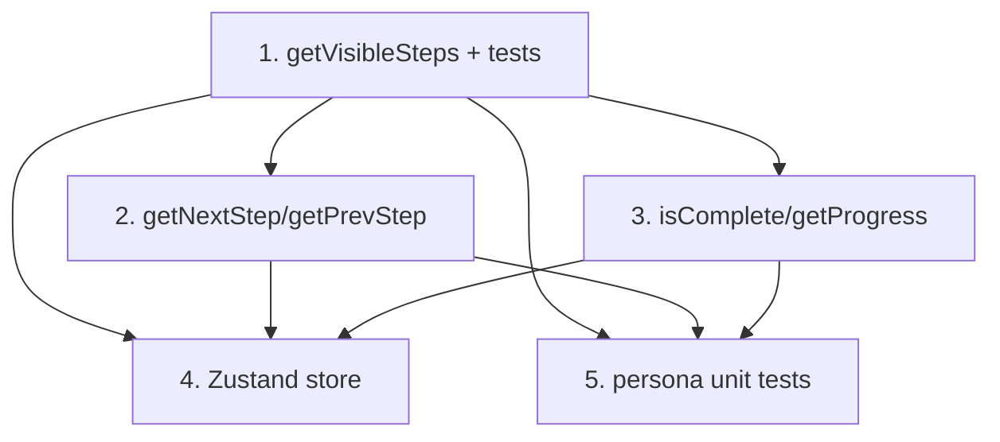

# GR-003: Form engine core (branching/visibility)

## Description

### Requirement

A pure, UI-free engine that answers one question given the schema (GR-002) and answers-so-far: **what does the patient see next, and when are they done?** This is the piece that has to be exactly right for the app to "feel obvious without instructions" — every UI spec (006, 009, 010, 013) renders whatever this engine says is visible, in the order it says.

### Design

Pure functions in `lib/engine/`, no React, no DOM — fully unit-testable in isolation (this is the TDD core of the project).

```ts
export interface StepId {
  section: "onboarding" | "A" | "B" | "C" | "D" | "E";
  questionKey: string;
  subKey?: string;
}

// The ordered list of steps a *specific* patient will see, given their profile so far.
// Excludes: Q6/Q7 when patient.sex !== "Female"; unrevealed followups (smoking_severity
// unless smoking=true; salon_treatment_detail unless salon_treatments=true; describe unless
// past_treatment_side_effects=true); product/procedure sub-fields for a row unless that
// row's used/done=true.
export function getVisibleSteps(
  profile: PatientProfile | null,
  answers: Partial<Answers>
): StepId[];

export function getNextStep(current: StepId, profile, answers): StepId | null;
export function getPrevStep(current: StepId, profile, answers): StepId | null;
export function isComplete(profile, answers): boolean; // true once every visible step (incl. onboarding + consent) has an answer
export function getProgress(
  profile,
  answers
): { completed: number; total: number; percent: number };
```

**Key branching rules to encode (exhaustive — this list IS the spec):**

- Onboarding (name/age/sex) always first, always required (age + sex; name optional).
- Q6, Q7 visible only if `profile.sex === "Female"`. Not shown at all for Male/Prefer-not-to-say (per the locked decision: direct onboarding capture, silent skip).
- Q11 `smoking_severity` visible only after `habits.smoking === true`.
- Q11 `salon_treatment_detail` visible only after `habits.salon_treatments === true`.
- Q12 per product row: `duration`/`helped`/`side_effects` visible only after that row's `used === true`.
- Q13 per procedure row: `sessions`/`helped` visible only after that row's `done === true`.
- Q14 `describe` visible only after `past_treatment_side_effects === true`.
- `getProgress` denominator must reflect the _current_ visible set (so a male patient's progress bar doesn't reserve two dead slots for Q6/Q7, and a "used: no" product row doesn't count its skipped sub-fields).
- The engine only computes visibility/order. It does **not** decide auto-clearing of exclusive options (e.g. "None") or default suggestions — that's GR-004's job. GR-003 must call into GR-004's rule functions when applying an answer, not duplicate that logic.

### Tasks

1. Write `getVisibleSteps` with full branching table from Design (test-first: write the persona-shaped test cases before the implementation).
2. Write `getNextStep`/`getPrevStep` as thin wrappers over `getVisibleSteps` (index math, not separate logic).
3. Write `isComplete`/`getProgress`.
4. Wire a Zustand store (`lib/engine/useIntakeStore.ts`) that holds `profile`, `answers`, current `StepId`, and exposes `answer(stepId, value)`, `next()`, `back()` — calling GR-004's rules inside `answer()` before persisting the value.
5. Unit tests covering every branch in the Design bullet list, for at least: a male patient, a female patient with regular cycle, a female patient currently pregnant.

## Task Dependency Graph



## Status

In Progress

## Acceptance Criteria

- [ ] Every branching rule listed in Design has a corresponding passing unit test.
- [ ] A male patient's visible-steps list never includes Q6 or Q7.
- [ ] A female, currently-pregnant patient's list includes Q6 and Q7 with Q7 defaulting to no pre-selected answer.
- [ ] Answering a product row's `used=false` removes that row's `duration`/`helped`/`side_effects` from the visible/required set; flipping back to `used=true` restores them.
- [ ] `getProgress().percent` reaches 100 only when every currently-visible step (including onboarding and consent) has a non-null answer.
- [ ] No React/DOM import anywhere in `lib/engine/` except the Zustand store file.
