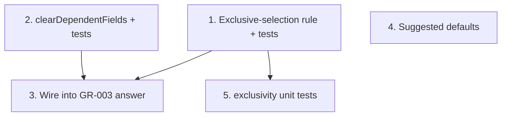

# GR-004: Inference & auto-skip rules

## Description

### Requirement

The deterministic, zero-AI logic that makes the form feel "smart" without calling any model: exclusive-option clearing in multi-selects, and table-row auto-skip. This is the main engine behind the "Taste" judging criterion for the multi-select and table questions — it should ship before any AI is involved, since it's free, instant, and 100% reliable.

### Design

Pure functions in `lib/rules/`, consumed by GR-003's `answer()` action.

```ts
// Multi-select exclusivity: some options are mutually exclusive with all others in the
// same question ("No known family history" vs the other 3 family_history options; "None"
// vs the other 5 diagnosed_conditions options). Declared per-question in a small config map,
// not hardcoded per-question in components.
export const EXCLUSIVE_OPTIONS: Record<string, string[]> = {
  family_history: ["No known family history"],
  diagnosed_conditions: ["None"],
};

export function applyExclusiveSelection(
  questionKey: string,
  currentSelection: string[],
  justTapped: string
): string[];
// Rule: if justTapped is in EXCLUSIVE_OPTIONS[questionKey], result = [justTapped] alone.
// If justTapped is NOT exclusive but an exclusive option is currently selected, drop the
// exclusive option and add justTapped. Otherwise, normal toggle (add/remove justTapped).

// Table auto-skip: when a row's leading bool flips to false, null out its dependent fields
// (rather than leaving stale values from a prior true state around).
export function clearDependentFields(
  row: ProductRow | ProcedureRow
): ProductRow | ProcedureRow;

// Soft defaults (nice-to-have, lower priority — do not block other tasks in this spec):
// pre-fill a suggested (not committed) value the patient can accept with one tap or change,
// e.g. hair_wash_frequency defaults to "Alternate Days". Suggested values must be visually
// distinct (e.g. a "suggested" chip state) from a patient-confirmed answer, and must NOT be
// included in getProgress()'s "completed" count until the patient actually confirms it.
export function getSuggestedDefault(
  questionKey: string,
  answers: Partial<Answers>
): unknown | null;
```

### Tasks

1. Implement `EXCLUSIVE_OPTIONS` map + `applyExclusiveSelection`, test-first against `family_history` and `diagnosed_conditions`.
2. Implement `clearDependentFields` for both `ProductRow` and `ProcedureRow`, test-first.
3. Wire both into GR-003's `answer()` action (GR-003 depends on this spec for that wiring — coordinate interface signatures before either is marked Done).
4. (Lower priority) Implement `getSuggestedDefault` for `hair_wash_frequency` only, as a proof of the pattern; leave the config map open for more later.
5. Unit tests: tapping "No known family history" after other options were selected clears them; tapping "Father had hair loss" after "No known family history" was selected clears the exclusive option and selects only the new one.

## Task Dependency Graph



Tasks 1 and 2 are independent of each other. Task 4 is optional/independent and can slip without blocking anything else.

## Status

In Progress

## Acceptance Criteria

- [ ] Selecting an exclusive option clears all others in that question; selecting any other option after an exclusive one was active clears the exclusive one.
- [ ] Flipping a product/procedure row's `used`/`done` from true to false nulls its dependent fields; flipping back to true does not resurrect the old stale values (starts blank).
- [ ] All rule functions are pure (no side effects, no store access) and independently unit-tested without GR-003 or any component mounted.
- [ ] `getSuggestedDefault`, if implemented, never counts toward `getProgress()`'s completed total until explicitly confirmed by the patient.
