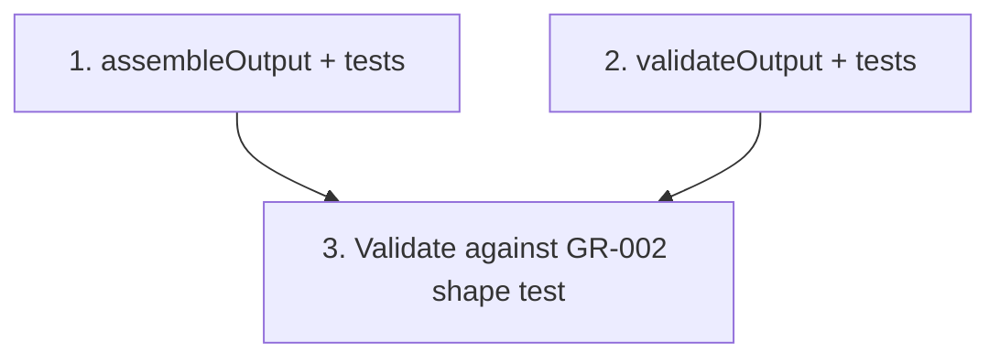

# GR-005: Output assembler & validator

## Description

### Requirement

Turn the store's `profile` + `answers` into the exact `IntakeOutput` shape defined in GR-002 — this is the literal "page 2, fully filled, visible as structured data" deliverable the whole project is graded on. Also validate completeness before letting the patient reach the review screen.

### Design

Pure functions in `lib/engine/assemble.ts`:

```ts
export function assembleOutput(
  profile: PatientProfile,
  answers: Partial<Answers>
): IntakeOutput;
// - Fills form/generatedAt.
// - For Male / Prefer-not-to-say patients: menstrual_cycle and pregnancy_related are set to
//   "Not applicable" even though the patient never saw those questions (key is always present —
//   see GR-002's decision).
// - For product/procedure rows never marked used/done: duration/helped/side_effects (or
//   sessions/helped) stay null, not omitted — every declared row from the schema appears.
// - habits.smoking_severity / salon_treatment_detail / describe are null when their gating
//   bool is false, never undefined (JSON.stringify-safe, key always present).

export interface ValidationResult {
  valid: boolean;
  missingSteps: StepId[];
}
export function validateOutput(profile, answers): ValidationResult;
// - Required: every currently-visible step per GR-003's getVisibleSteps must have a non-null
//   answer, INCLUDING consent (Q16) — consent must be explicitly true or false, never left
//   unanswered. A patient who explicitly declines consent (consent=false) is still "valid" —
//   decline is a legitimate, complete answer, not a blocker. Only a genuinely unanswered
//   required step makes the output invalid.
```

Design note carried over from GR-002: the assembler is the _only_ place that should ever construct an `IntakeOutput`. GR-014 (review screen) must call `assembleOutput`, never build the JSON itself.

### Tasks

1. Implement `assembleOutput`, test-first against fixtures for a male patient and a female patient.
2. Implement `validateOutput`, test-first: an intake missing consent is invalid; an intake with consent explicitly `false` and everything else answered is valid.
3. Confirm `assembleOutput`'s return value passes GR-002's key-shape test (reuse that test against a fully-answered fixture).

## Task Dependency Graph



Tasks 1 and 2 are independent and can be built in parallel.

## Status

In Progress

## Acceptance Criteria

- [ ] `assembleOutput` output always contains all 16 question keys across all 5 sections, regardless of branching (gated/skipped fields are `null` or `"Not applicable"`, never missing).
- [ ] Running `assembleOutput` on a fully-answered male-patient fixture and a fully-answered female-patient fixture both pass GR-002's shape/key test.
- [ ] `validateOutput` flags a genuinely unanswered required step as invalid, and treats an explicit `consent: false` as valid (not a blocker).
- [ ] No component in the codebase constructs the output JSON except through `assembleOutput`.
