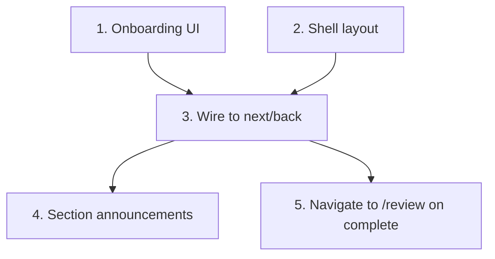

# GR-006: Onboarding + single-scroll stepper shell

## Description

### Requirement

The single screen the patient lives in for the whole intake: a short "about you" onboarding step, then a continuous, animated, one-step-at-a-time flow through sections A–E driven entirely by GR-003's engine. This is what judges see first, so it has to read as "snappy" and "obvious without instructions" within seconds.

### Design

- Route: `/app/intake/page.tsx`. No other patient-facing route except `/review` (GR-014) and the onboarding is a step _within_ this same screen, not a separate page — reinforces "one screen, many steps."
- **Onboarding step** (renders first, before Section A):
  - Name: optional text field, placeholder "e.g. Priya Sharma (optional)" — explicitly cosmetic, never required to proceed.
  - Age: number input.
  - Sex: three large tap targets — Male / Female / Prefer not to say. Framed conversationally ("So we ask the right next few questions") rather than as a clinical form field, per the locked design decision.
  - Selecting "Prefer not to say" behaves like Male for gating purposes (Q6/Q7 hidden) but is stored distinctly in `patient.sex` so the output is honest about what was actually said.
- **Stepper shell**: one question-unit visible at a time (component from GR-007), animated transition between steps (Framer Motion, slide/fade — actual motion tokens come from GR-008), a persistent top progress bar segmented by section (A/B/C/D/E) using `getProgress()` from GR-003, a back button, and section headers that briefly announce ("Section B of 5 · Hormonal & Health") on entry.
- Shell subscribes to the Zustand store from GR-003; it does not itself contain branching logic — it just renders `getVisibleSteps()[currentIndex]` via a per-question-type dispatcher (built out in GR-007/009/010/013).
- On reaching the last visible step (consent, Q16) with `isComplete() === true`, shell navigates to `/review`.

### Tasks

1. Build the onboarding step UI (name/age/sex) wired to `profile` in the store.
2. Build the shell layout: progress bar, section header, back button, step container.
3. Wire step transitions to GR-003's `next()`/`back()`, with placeholder question rendering (real per-type components arrive in GR-007/009/010/013 — shell should render a generic fallback until those land, so this spec isn't blocked waiting on them).
4. Add section-entry announcement micro-copy.
5. Navigate to `/review` when `isComplete()` is true after the last step.

## Task Dependency Graph

## Status

In Progress

## Acceptance Criteria

- [ ] Loading `/intake` shows the onboarding step first; leaving name blank does not block continuing.
- [ ] Progress bar accurately reflects `getProgress()` and updates live as steps are answered.
- [ ] Only one question-unit is visible on screen at a time; transitioning steps is animated, not an instant jump-cut.
- [ ] Back button returns to the exact previous visible step (respecting branching — e.g. for a male patient, back-navigating from Q8 goes to Q5, not through the hidden Q6/Q7).
- [ ] Reaching consent with everything else answered redirects to `/review` automatically.
