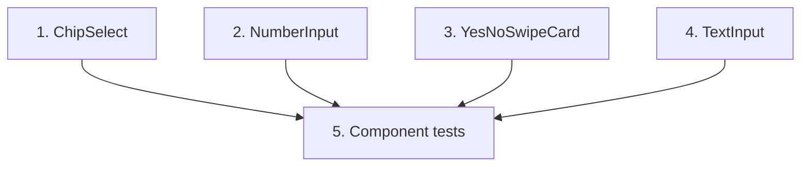

# GR-007: Core input primitives

## Description

### Requirement

The reusable input components every question type maps to. Built once, schema-driven, so no question gets a bespoke one-off component. Must work equally well by touch (phone) and by mouse/keyboard (laptop) — the brief explicitly says judges try both.

### Design

Components in `components/inputs/`:

- **`ChipSelect`** — single or multi-select as tappable pill/chip buttons (not a `<select>` dropdown — chips are faster to scan and tap). Multi mode calls GR-004's `applyExclusiveSelection` on every tap rather than a plain array toggle.
- **`NumberInput`** — large +/- stepper buttons flanking a numeric field (for Q1 age-hair-loss-began), plus direct keyboard entry; clamps to sane bounds (e.g. 5–90).
- **`YesNoSwipeCard`** — swipeable card (right = yes, left = no) with **visible Yes/No buttons underneath as a first-class fallback**, not a hidden affordance — required for laptop/mouse users and for accessibility (a swipe-only control fails non-touch judges immediately). Confirmed via GR-016 in a later pass, but built in from day one here, not retrofitted.
- **`TextInput`** — single-line/multi-line text field with a reserved slot for a mic button (wired by GR-011 later; this spec just leaves the slot and prop, doesn't implement voice itself).
- All primitives accept `value`/`onChange` only — no knowledge of the schema, the store, or branching. They're dumb, tested-in-isolation components.

### Tasks

1. `ChipSelect` (single + multi variants), wired to `applyExclusiveSelection` for multi mode.
2. `NumberInput` with stepper + keyboard entry + bounds clamping.
3. `YesNoSwipeCard` with swipe gesture (Framer Motion drag) AND visible tap buttons.
4. `TextInput` with `onVoiceRequest` prop slot (no-op until GR-011).
5. Component tests (RTL) for each: renders, fires `onChange` with correct value on tap/keyboard, `YesNoSwipeCard` fires correctly on button click (not just swipe, since swipe is hard to simulate reliably in jsdom).

## Task Dependency Graph

Tasks 1–4 are fully independent and can be built in parallel by separate agents.

## Status

In Progress

## Acceptance Criteria

- [ ] Every primitive works via mouse click alone with no touch/swipe required (laptop judge path).
- [ ] `ChipSelect` multi-mode correctly clears/sets exclusive options per GR-004's rule (verified via a component test, not just the unit-level rule test).
- [ ] `YesNoSwipeCard` has visibly labeled Yes/No buttons at all times, not only on hover or after a failed swipe.
- [ ] `NumberInput` cannot be set outside its declared bounds via either the stepper or direct typing.
- [ ] All four primitives have passing RTL tests with no console errors/warnings.
