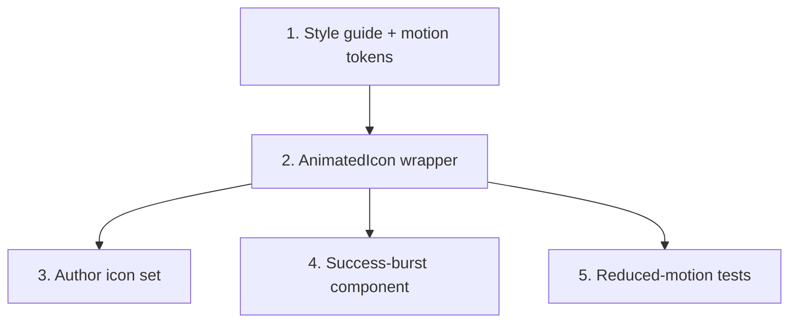

# GR-008: Icon & micro-interaction system

## Description

### Requirement

One consistent, custom-authored visual language for icons and motion, used everywhere — this is the main lever for "most eye-catching, modern looking UI." Built once here so GR-009/010/011/013/014 all draw from the same system instead of each inventing its own icon style.

### Design

- **Icon style guide** (`components/icons/README.md`): single stroke width (2px at 24×24 viewBox), rounded line-caps, two-color max per icon (stroke + one accent fill), consistent corner radius. No mixing in a generic third-party icon font/library — every icon here is hand-authored inline SVG so the look stays distinctive and the bundle stays small.
- **Icon manifest** (`components/icons/manifest.ts`): maps semantic names to components, e.g. `IconCalendar` (duration questions), `IconFamilyTree` (Q3), `IconShower` (hair-wash frequency), `IconFlame`/`IconStrand` (shedding, Q10), `IconPillBottle` (Q12 products), `IconDroplet`/`IconSyringe` (Q13 procedures, Q15 sample type), `IconMic` (voice), `IconCheck` (confirmation states). Each is a small `AnimatedIcon` React component wrapping raw SVG with Framer Motion variants for entrance/idle/active states.
- **Motion tokens** (`lib/motion/tokens.ts`): shared durations/easings (e.g. `fast=150ms`, `base=250ms`, `slow=400ms`, a single easing curve) so every spec's animations feel like one system instead of ad hoc per-component timings.
- **Conventions, documented and enforced by reuse (not by a linter):**
  - Icon draw/scale-in when its question enters.
  - Chip tap → brief scale-bounce.
  - Correct selection → checkmark path-draws in.
  - Section complete → small success burst (confetti-lite, SVG-based, not a heavy external Lottie/confetti library).
  - All animations respect `prefers-reduced-motion` (checked here at the token level so every consumer gets it for free; verified again in GR-016).
- No external icon packages, no Lottie files pulled from a CDN (the artifact/app CSP-style discipline: keep everything self-contained, self-authored, small).

### Tasks

1. Write the style guide doc + motion tokens file.
2. Build `AnimatedIcon` wrapper component (entrance/idle/active variants, reduced-motion guard baked in).
3. Author the icon set listed above (start with the ~10 most-used; expand as GR-009/010/013 identify more needs — this manifest is allowed to grow, coordinate additions here rather than each spec inlining its own one-off SVG).
4. Build the section-complete success-burst component.
5. Component tests: icons render, respect `prefers-reduced-motion` (animation variants collapse to instant/no-op when the media query matches).

## Task Dependency Graph

## Status

Done — [PR #3](https://github.com/SharmaSamridhhi/genoroot/pull/3)

## Acceptance Criteria

- [ ] Every icon in the manifest is inline SVG authored for this project — zero external icon-library or CDN dependency.
- [ ] All animations route through the shared motion tokens, not ad hoc magic-number durations.
- [ ] With `prefers-reduced-motion: reduce` simulated, entrance/idle animations are disabled or reduced to an instant state change, verified by a test.
- [ ] The manifest and style guide are documented well enough that GR-009/010/013 can add a new icon without inventing a new stroke style.
