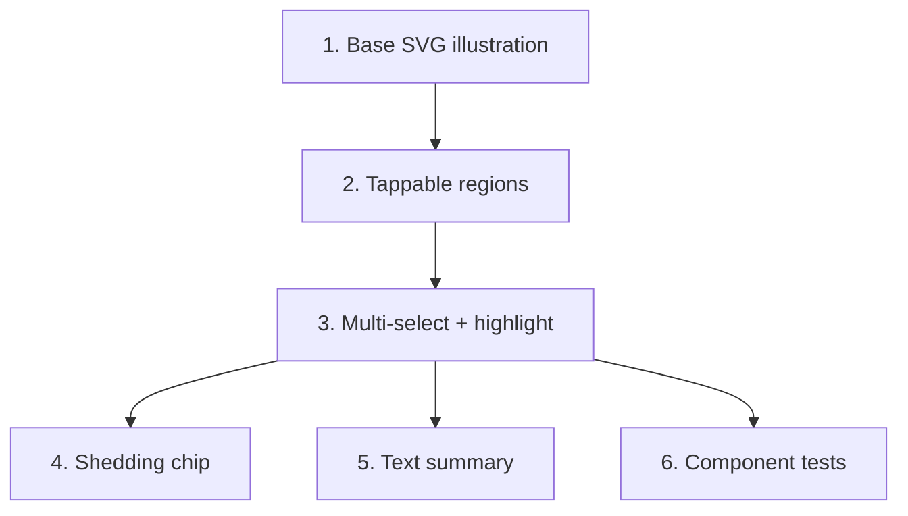

# GR-009: Interactive scalp diagram (Q4 pattern)

## Description

### Requirement

Q4 ("pattern") is the flagship "taste" moment: instead of a checkbox list of 6 anatomical descriptions, the patient taps directly on an illustrated head/scalp diagram. This is one of the most visible differentiators in a live demo.

### Design

- `components/questions/ScalpPatternPicker.tsx` — an inline SVG head (front + top view, or a single stylized top-down view — pick whichever reads clearly at small mobile size) with **tappable/clickable regions** mapped to 5 of the 6 schema options:
  - Receding hairline → front hairline region
  - Thinning at crown → crown region
  - Widening part line → part-line region
  - Diffuse thinning → whole-scalp overlay toggle
  - Patchy loss → one or more freeform patch markers the patient can place (or a simpler "patchy" region toggle if freeform placement is too costly for the timeline — freeform is a stretch, not required)
  - **"Sudden excessive shedding" is not spatial** — it doesn't map to a scalp region, so it renders as a separate chip/toggle alongside the diagram, not forced into the illustration.
- Multi-select: multiple regions can be active at once (matches the schema's `type: "multi"`), each active region gets a distinct fill/highlight using GR-008's motion tokens for the toggle animation.
- **Must work by mouse click, not only touch** — each region is a real clickable SVG element (or an invisible `<button>` overlay) with a visible hover state on non-touch devices, per the phone-and-laptop judging requirement.
- Selected regions are also reflected as a small text summary below the diagram ("Selected: Thinning at crown, Widening part line") so the answer is legible even to someone unsure what they tapped — this doubles as the accessible/screen-reader-friendly representation.
- Underlying state is still just `pattern: string[]` matching GR-002's schema — the diagram is purely a novel input method for the same data contract, output is identical to a plain multi-select.

### Tasks

1. Draw/author the base SVG head illustration in GR-008's icon style (reuse stroke width/style, don't invent a new visual language for this one component).
2. Define tappable region hit-areas and wire each to its exact schema option string.
3. Implement multi-select toggle state + active-region highlight animation.
4. Add the non-spatial "Sudden excessive shedding" chip alongside the diagram.
5. Add the text summary of current selections below the diagram.
6. Component tests: clicking a region toggles the corresponding option string in the underlying value; clicking twice deselects.

## Task Dependency Graph

## Status

In Progress

## Acceptance Criteria

- [ ] All 6 `pattern` options from the schema are reachable through this component (5 via the diagram, 1 via the standalone chip) — none silently unreachable.
- [ ] Multiple regions can be selected simultaneously; the underlying value is a `string[]` identical in shape/content to what a plain multi-select would produce.
- [ ] Every region is clickable with a mouse (not gated behind a touch-only gesture) and shows a hover affordance on desktop.
- [ ] A text summary of current selections is always visible/readable, independent of the graphic.
