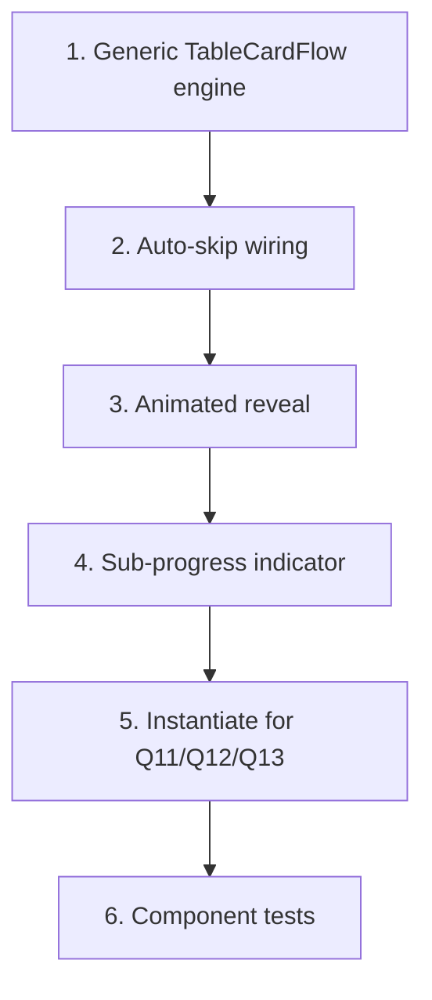

# GR-010: Table-as-cards flow (Q11–Q13)

## Description

### Requirement

Q11 (habits, 6 rows), Q12 (products, 5 rows × 4 columns), Q13 (procedures, 4 rows × 3 columns) are matrix questions — rendered as literal tables they'd be the single biggest reason a 55-year-old abandons the form on a phone. This spec is the highest-risk, highest-payoff UX work in the project: turn each table into a one-row-at-a-time card sequence with auto-skip, so a "no" answer on a row costs one tap instead of three.

### Design

- `components/questions/TableCardFlow.tsx` — generic engine driven by GR-002's table schema (rows + columns), reused for all three tables rather than three bespoke implementations.
- Flow per row: show the row's lead question first (e.g. "Used topical minoxidil?" / "Done PRP/GFC/iPRF?" / for Q11, each habit's own yes/no). A "No"/"false" answer immediately advances to the next row — the dependent sub-fields (duration/helped/side_effects, or sessions/helped, or smoking_severity/salon_treatment_detail) never render at all for that row. This is GR-004's `clearDependentFields` visualized.
- A "Yes"/"true" answer reveals the row's remaining sub-fields inline, one at a time or as a small chip cluster, with a short animated reveal (GR-008 motion tokens) rather than an abrupt layout jump.
- Sub-progress indicator within the table itself ("Row 2 of 5") separate from the overall section progress bar, so the patient always knows how much of _this_ table is left.
- Back navigation within a table must preserve already-answered rows (going back from row 3 to row 2 doesn't wipe row 1).
- Reuses GR-007 primitives (`ChipSelect`, `YesNoSwipeCard`, `TextInput`) for each field — this spec is the orchestration layer, not a new set of input widgets.
- Q11's `salon_treatment_detail` and Q14's `describe` (handled elsewhere but same pattern) are the two fields that benefit most from voice (GR-011) — leave the `onVoiceRequest` slot wired through from `TextInput`.

### Tasks

1. Build the generic `TableCardFlow` engine parameterized by row/column schema (no hardcoded question logic inside it).
2. Wire lead-question → auto-skip-on-no behavior using GR-004's `clearDependentFields`.
3. Build the animated reveal for a row's sub-fields on "Yes".
4. Add the sub-progress indicator ("Row X of Y").
5. Instantiate the engine for Q11 (habits — note this one has heterogeneous row types, not a uniform column set like Q12/Q13, so its row config differs), Q12 (products), and Q13 (procedures).
6. Component tests: answering "No" on a row never renders that row's sub-fields; answering "Yes" reveals exactly the sub-fields declared for that row; back-navigation preserves prior rows' answers.

## Task Dependency Graph

## Status

In Progress

## Acceptance Criteria

- [ ] For any row across Q11/Q12/Q13, answering "No"/"false" advances immediately with zero additional taps for that row's sub-fields.
- [ ] Answering "Yes"/"true" reveals exactly the sub-fields the schema declares for that row — no more, no less.
- [ ] Navigating back within a table does not lose previously answered rows.
- [ ] The same `TableCardFlow` component (not three separate implementations) powers all three tables.
- [ ] A full run through all three tables with mostly "No" answers takes visibly fewer taps than a full run with mostly "Yes" answers (this is the entire point — verified qualitatively in GR-016/demo, but the mechanism is tested here).
