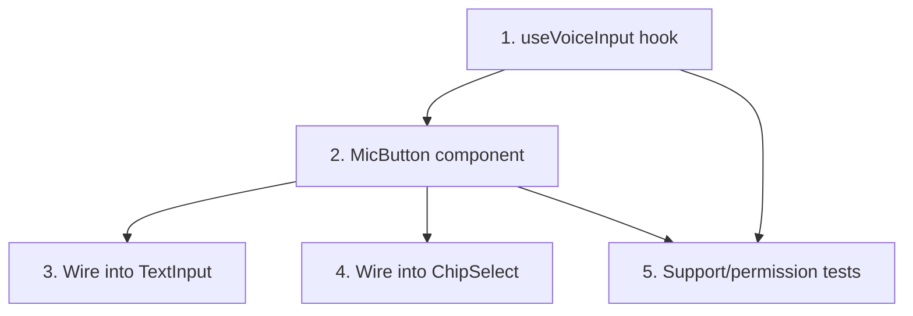

# GR-011: Voice input capture

## Description

### Requirement

Voice as a per-field accelerator (not the whole interface) for the genuinely free-text moments: Q11 `salon_treatment_detail`, Q14 `describe`, and as an alternate input on choice questions for patients who'd rather speak than read a long option list. Tap remains the default/faster path everywhere; voice is opt-in via a mic button.

### Design

- `lib/voice/useVoiceInput.ts` — a hook wrapping the **Web Speech API** (`SpeechRecognition`/`webkitSpeechRecognition`), exposing `{ isSupported, isListening, transcript, start, stop, error }`. Zero cost, zero API key, runs entirely client-side — the "bought nothing, used what the platform gives us" resourcefulness story for the capture layer (Groq/GR-012 is only for interpreting the transcript afterward, not for capturing audio).
- `components/inputs/MicButton.tsx` — visual states (idle / listening-pulse / processing / error), using GR-008's motion tokens for the listening-pulse animation.
- **Browser support detection is mandatory, not an edge case**: Web Speech API support is inconsistent (notably absent/partial in desktop Firefox and some mobile browsers). When `isSupported === false`, the mic button doesn't render at all — the field silently falls back to the plain `TextInput`/`ChipSelect` it already is. The app must never show a mic button that doesn't work.
- Microphone permission denial: shown as a brief inline message ("Mic access denied — you can type instead") next to the field, never a blocking modal or dead-end.
- Live transcript is shown as the patient speaks (not just after they stop) so they can see it's working — critical for the "obvious without instructions" bar.
- On stop, the raw transcript is handed to GR-012 for structured interpretation (for free-text fields) or local fuzzy-matching first, Groq fallback second (for choice fields) — this spec owns capture only; GR-012 owns interpretation.

### Tasks

1. `useVoiceInput` hook with support detection, start/stop, live transcript, error states.
2. `MicButton` component with all visual states wired to the hook.
3. Wire `MicButton` into `TextInput`'s existing voice slot (from GR-007) for Q11/Q14.
4. Add mic affordance to `ChipSelect` for choice questions as an alternate input path (speak an option instead of tapping).
5. Component tests: mic button doesn't render when `isSupported` is false (mock the API absence); permission-denied path shows inline message and doesn't block typing.

## Task Dependency Graph

## Status

In Progress

## Acceptance Criteria

- [ ] On a browser without Web Speech API support, no mic button renders anywhere, and every field remains fully usable by typing/tapping alone.
- [ ] Denying microphone permission shows a non-blocking inline message; the patient can continue via text/tap without any dead end.
- [ ] Live transcript updates visibly while the patient is speaking, not only after they stop.
- [ ] This spec contains no calls to Groq or any external API — capture only, interpretation lives in GR-012.
