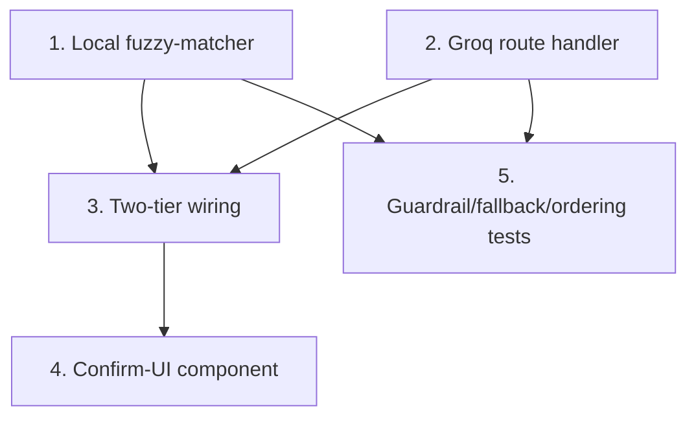

# GR-012: Groq parse route + confirm UI

## Description

### Requirement

The one place in the app that calls out to an LLM: turning a voice transcript into structured data, for the cases where deterministic matching isn't enough (free-text description fields, or a spoken sentence that doesn't cleanly match a fixed option list). Scoped deliberately narrow, cheap, and always patient-confirmed — never a silent write to clinical data.

### Design

- **Provider: Groq** (OpenAI-compatible chat completions endpoint), using the free-tier `GROQ_API_KEY` already provisioned. Model: a fast Llama model available on Groq (e.g. `llama-3.1-8b-instant`) — pick for latency first, since this sits in the middle of an interaction the patient is actively waiting on.
- **Route: `app/api/parse/route.ts`** (Next.js Route Handler, server-side only). This is the _only_ place `GROQ_API_KEY` is read — it must never reach client-side JS/bundle. Request body: `{ transcript: string; fieldType: "free_text" | "choice_match"; options?: string[] }`. Response: `{ text?: string; matchedOptions?: string[]; confidence: "high" | "low" }`.
- **Two-tier matching strategy — Groq is the fallback, not the default:**
  1. For `choice_match` fields, try a local deterministic match first (substring/fuzzy match transcript tokens against the option list — no network call, instant, free). This handles the large majority of cases (patient says something close to an actual option).
  2. Only call the Groq route when the local match is inconclusive (no option clears a confidence threshold) or the field is genuinely `free_text` (Q11 salon detail, Q14 describe), where the goal is just cleaning up the raw transcript into readable text, not matching it to anything.
- **Groq's JSON mode (`response_format: { type: "json_object" }`) is used, but its output is not trusted blindly**: for `choice_match`, the route validates every returned string against the `options` array it was given and drops anything that isn't an exact match — the model can only ever narrow down to options that actually exist in the schema, never invent one. This is the correctness guardrail given Groq doesn't offer OpenAI's stricter schema-enforced mode.
- **Failure handling**: network error, timeout (set an explicit ~4s timeout), or empty/invalid response all fall back gracefully to the raw transcript (for free_text) or "no confident match, ask the patient to pick manually" (for choice_match) — the flow must never hang or dead-end waiting on Groq.
- **Confirm UI**: whatever the route returns is shown as an editable, clearly-labeled suggestion (e.g. a pre-filled but still-editable text field, or pre-highlighted-but-not-yet-committed chips) — the patient must take one explicit confirming action before it's written to the store. This applies regardless of which tier (local match or Groq) produced the suggestion.
- API key handling: `GROQ_API_KEY` read via `process.env` only inside the route handler; confirm it's listed in `.env.example` (from GR-001) with no value committed.

### Tasks

1. Build the local deterministic fuzzy-matcher for `choice_match` (no network dependency).
2. Build `app/api/parse/route.ts` calling Groq's chat completions endpoint with JSON mode, the ~4s timeout, and the options-validation guardrail.
3. Wire the two-tier strategy: local match attempted first, Groq route called only on low-confidence/free-text cases.
4. Build the confirm-UI pattern (editable suggestion + explicit confirm action) as a shared component, used by both the local-match and Groq paths identically.
5. Tests: route returns only options present in the input `options` array even if mocked-Groq-response includes an invented one (guardrail test); route falls back cleanly on a simulated timeout/network error; local matcher is tried before any network call is made (spy/mock the fetch and assert it's not called for a clear local match).

## Task Dependency Graph

Tasks 1 and 2 are independent and can be built in parallel.

## Status

In Progress

## Acceptance Criteria

- [ ] `GROQ_API_KEY` never appears in any client-side bundle or browser network request — confirmed by inspecting the built client JS / browser devtools network tab, not just by code review.
- [ ] For a `choice_match` request, any model-returned string not present in the provided `options` array is discarded before reaching the UI.
- [ ] A simulated Groq timeout/error does not block the patient — the flow falls back to manual entry within the ~4s timeout window.
- [ ] Nothing this route returns is ever written to the intake store without an explicit patient confirmation action.
- [ ] A clear local fuzzy-match is resolved without any network call to Groq (verified in tests).
