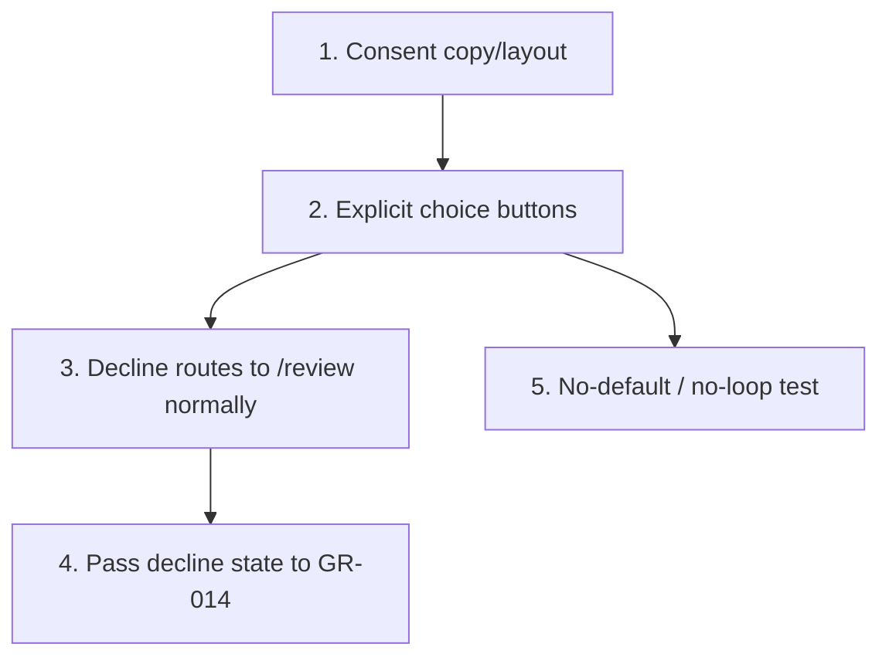

# GR-013: Consent screen (Q16)

## Description

### Requirement

Q16 — consent to sample collection and genetic analysis — is the last question and the most ethically significant one in the form. It gets deliberately different treatment from every other yes/no in the app: no swipe, no casual gamified interaction, an explicit and unambiguous choice.

### Design

- `components/questions/ConsentScreen.tsx` — a distinct full-width step, visually set apart from the preceding chip/swipe questions (different background treatment or a bordered card, using GR-008's system but a more formal/still composition — less playful motion than the rest of the app on this one screen specifically).
- Plain-language explanation of what consent covers, directly above the choice (not a wall of legal text — a short, clear sentence or two).
- Two large, clearly labeled buttons: **"I agree"** / **"I do not agree"** — explicit tap targets, not a swipe gesture, not a toggle that defaults to either state. No option is pre-selected.
- Declining consent (**"I do not agree"**) does **not** block or dead-end the flow — the patient still proceeds to `/review` with `consent: false` recorded accurately. The app's job is to capture the true answer for the doctor, not to coerce a "yes." (Reject any implementation that disables/hides the decline option, retries the question, or otherwise pressures a change of answer.)
- If declined, the review screen (GR-014) shows a brief, neutral note that sample collection can't proceed without consent — informational only, not a re-prompt loop back into this screen.

### Tasks

1. Build the consent copy + layout (visually distinct from the rest of the flow).
2. Build the two explicit-choice buttons, wired to `consent: boolean` in the store, no default pre-selection.
3. Ensure declining routes to `/review` exactly like agreeing does (no special-cased block).
4. Pass the `consent: false` case through to GR-014 for its neutral informational note.
5. Component test: neither button is pre-selected/focused as an implicit default; clicking "I do not agree" completes the step and does not re-prompt or loop.

## Task Dependency Graph

## Status

In Progress

## Acceptance Criteria

- [ ] No option is pre-selected on load; the step cannot be "completed" by default/inaction — an explicit tap on one of the two buttons is required.
- [ ] Declining consent proceeds to `/review` exactly like agreeing does — no blocking modal, no forced retry, no disabled continue button.
- [ ] `consent: false` is recorded accurately in the store/output and never silently coerced to `true`.
- [ ] This screen's visual/motion treatment is visibly more restrained/formal than the swipe-card questions elsewhere in the flow.
