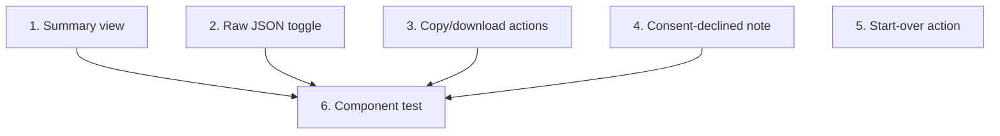

# GR-014: Review / "page 2" output screen

## Description

### Requirement

The one fixed deliverable of the whole project: a screen showing the fully-filled form as structured data. This is `assembleOutput()`'s (GR-005) result, rendered for a doctor to scan quickly and for a grader to verify programmatically.

### Design

- Route: `/app/review/page.tsx`. Reads the completed intake from the store, calls `assembleOutput()` (never constructs the JSON itself — GR-005 owns that).
- **Two views, one toggle:**
  1. **Doctor-facing summary** (default view) — grouped by section (A–E) with human-readable labels, using GR-008's icon set for section headers, laid out for a fast scan (not a dense form replica — think a clean clinical summary card per section).
  2. **Raw JSON view** — a toggle reveals the exact `IntakeOutput` object, formatted/indented, in a scrollable monospace block. This is what satisfies "visible as structured data" literally and is what a grader/judge will actually check for correctness.
- **Copy/download JSON** action — copies the JSON to clipboard (and/or triggers a browser download of a `.json` file) so a judge or a downstream system could grab it without hunting through devtools.
- If `consent === false`: a neutral, non-alarming note near the top ("Sample collection requires consent — patient declined") — informational, not an error state.
- A "start over" action (ties into GR-015) resets the store for a new mock patient — useful for demoing multiple personas back-to-back without a page reload.
- No editing on this screen — it's read-only output. If something's wrong, the patient/demo-runner goes back into `/intake` (or starts over), rather than this screen doubling as another form.

### Tasks

1. Build the doctor-facing summary view, section by section, using GR-008 icons for headers.
2. Build the raw JSON toggle view (formatted, scrollable, readable at small screen widths too).
3. Build copy-to-clipboard and download-as-file actions.
4. Add the consent-declined informational note.
5. Wire the "start over" action.
6. Component test: rendering a fully-answered fixture produces a summary view covering all 16 questions and a JSON view matching `assembleOutput()`'s output exactly.

## Task Dependency Graph

Tasks 1–5 are independent of each other and can be built in parallel once GR-005 is done.

## Status

Not Started

## Acceptance Criteria

- [ ] The raw JSON view exactly matches `assembleOutput()`'s return value — no re-derivation, no drift between what's displayed and the canonical output.
- [ ] All 16 questions' answers are visibly represented in the summary view (spot-checkable against the original brief question-by-question).
- [ ] Copy-to-clipboard and/or download produces valid, parseable JSON.
- [ ] A declined-consent intake renders normally (no crash, no blocked screen) with the informational note shown.
- [ ] This screen contains no input controls that mutate intake answers — strictly read-only plus start-over.
