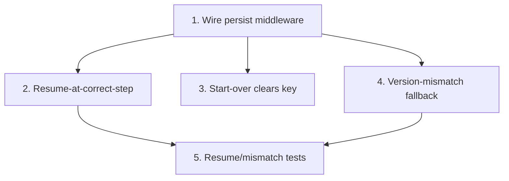

# GR-015: Local persistence (resume/reset)

## Description

### Requirement

No login, no backend, no database — but a patient who gets interrupted mid-intake (phone locks, browser backgrounds, accidental refresh) shouldn't lose their progress. Purely client-side, session-scoped persistence.

### Design

- Zustand's `persist` middleware backing the store from GR-003, writing to `localStorage` under a single namespaced key (e.g. `genoroot-intake-v1`).
- Autosave on every `answer()` call — no explicit "save" step, no debounce needed at this scale.
- On load, if a persisted-but-incomplete intake exists, resume directly at the last visible step (not back to onboarding) rather than silently discarding it.
- **Single active intake at a time** — this app has no concept of multiple concurrent patients/sessions (no login), so persistence is intentionally simple: one key, one in-progress intake. Starting a fresh one (GR-014's "start over") explicitly clears the key rather than layering a second intake on top.
- Versioned key (`-v1` suffix) so a future schema change doesn't try to rehydrate an incompatible shape — on a version mismatch, treat as no persisted state (fresh start) rather than crashing.
- No PII concern here beyond what the rules already require (mock/placeholder patients only) — but still worth noting this data never leaves the browser; nothing in this spec talks to a server.

### Tasks

1. Wire Zustand `persist` middleware to the store from GR-003 with the versioned key.
2. On app load, detect a persisted incomplete intake and resume at the correct step (via GR-003's `getVisibleSteps`/current index, not just "step 1").
3. Wire "start over" (used by GR-014) to clear the persisted key and reset store to initial state.
4. Handle a version mismatch (schema changed since the persisted blob was written) by falling back to a fresh start instead of throwing.
5. Tests: simulate a persisted partial intake in localStorage, mount the app, assert it resumes at the right step; simulate a version-mismatched blob, assert fresh start with no crash.

## Task Dependency Graph

## Status

Done — [PR #6](https://github.com/SharmaSamridhhi/genoroot/pull/6)

## Acceptance Criteria

- [ ] Refreshing the browser mid-intake resumes exactly where the patient left off, not back at onboarding.
- [ ] "Start over" fully clears the persisted state — a subsequent refresh does not resurrect the old intake.
- [ ] A corrupted or version-mismatched localStorage blob never crashes the app on load — it falls back to a fresh intake.
- [ ] No network call is involved anywhere in this spec — persistence is 100% client-side.
