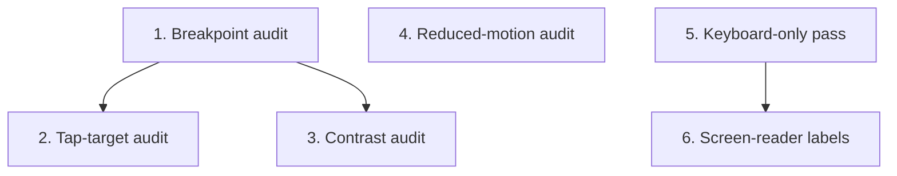

# GR-016: Responsive & accessibility pass

## Description

### Requirement

The brief's #1 judging criterion is explicitly "finishable by a 55-year-old on a phone," tested on both a phone and a laptop. This spec is the cross-cutting pass that verifies and fixes every prior UI spec against that bar — it runs last among the UI specs, once GR-006/007/009/010/011/013/014 are functionally done.

### Design

- **Breakpoints**: verify at ~375px (small phone), ~768px (tablet), ≥1024px (laptop). No horizontal scrolling at any width; no element requiring pixel-precise taps.
- **Tap targets**: every interactive element (chips, buttons, mic icon, scalp-diagram regions, consent buttons) ≥44×44px per standard mobile guidance — audit and fix any that fall short, especially the scalp-diagram regions from GR-009 which are the most likely to be too small on first pass.
- **Contrast**: text and interactive elements meet WCAG AA contrast ratios in both light context (this is a clinic kiosk/phone app, dark mode is not a requirement here unless already trivially supported by the Tailwind setup — don't build a new dark theme for this pass, just verify legible contrast in the one theme the app ships).
- **Motion**: confirm `prefers-reduced-motion` is honored everywhere (GR-008 built the mechanism; this pass verifies every consumer actually respects it, including GR-009's diagram animations and GR-010's row-reveal animations).
- **Keyboard/non-touch path**: full intake completable via mouse + keyboard alone with no dead ends — tab order is logical, Enter/Space activate the focused control, GR-007's `YesNoSwipeCard` buttons and GR-009's scalp regions are keyboard-focusable and activatable (not swipe/click-only).
- **Legibility for a 55-year-old**: base font size large enough to read without zooming (audit against a sensible minimum, e.g. 16px body text), plain language in all micro-copy (no clinical jargon beyond what the brief itself uses), generous spacing over dense layouts.
- **Basic screen-reader labels**: `aria-label`s on icon-only buttons (mic, back, section icons), form fields properly associated with their labels — a baseline pass, not a full WCAG audit.

### Tasks

1. Breakpoint audit across all screens (`/intake` every step type, `/review`) at 375px/768px/1024px+; fix any overflow/cramped layout found.
2. Tap-target audit, with special attention to GR-009's scalp diagram regions; enlarge hit areas as needed (can exceed the visible graphic's bounds).
3. Contrast audit against WCAG AA; fix any failing text/button color pairs.
4. Reduced-motion audit: manually toggle the OS/browser setting and confirm every animated component (GR-008, GR-009, GR-010) degrades gracefully.
5. Keyboard-only completion pass: complete a full intake using only Tab/Enter/Space/arrow keys, no mouse, no touch; fix any dead end found.
6. Screen-reader label pass on icon-only interactive elements.

## Task Dependency Graph

Tasks 1, 3, 4, and 5 can start independently in parallel once their target specs are functionally done; task 2 follows naturally from 1; task 6 follows from 5.

## Status

Not Started

## Acceptance Criteria

- [ ] Full intake-to-review flow completable at 375px width with no horizontal scroll and no element requiring zoom to read or hit.
- [ ] Full intake-to-review flow completable using only a mouse+keyboard (no touch, no swipe) on a laptop viewport.
- [ ] Full intake-to-review flow completable using only keyboard navigation (Tab/Enter/Space), with visible focus states throughout.
- [ ] No interactive element measured under 44×44px.
- [ ] Toggling `prefers-reduced-motion` visibly reduces/removes entrance and idle animations app-wide, verified on at least GR-009's diagram and GR-010's row reveals.
- [ ] Icon-only buttons (mic, back, etc.) have accessible labels readable by a screen reader.
