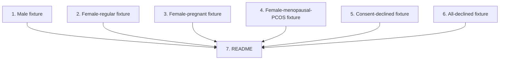

# GR-017: Persona test suite (correctness proof)

## Description

### Requirement

Direct answer to the brief's "how you checked the form actually gets filled correctly" resourcefulness question. Since GR-016 decided against a full Playwright e2e suite, this spec carries that entire burden at the logic layer: run realistic mock patients through the engine (GR-003) + rules (GR-004) + assembler (GR-005) with no UI/browser involved, and assert the final JSON is exactly right. Fast, deterministic, CI-friendly.

### Design

- `tests/personas/` — one fixture file per persona, each a scripted sequence of `answer()` calls against the real store (GR-003), followed by `assembleOutput()` (GR-005) and an assertion against a hand-written expected `IntakeOutput`.
- **Personas to cover (minimum set — expand if time allows):**
  1. **Male, straightforward case** — confirms Q6/Q7 are `"Not applicable"` in output despite never being shown; confirms a `family_history` exclusive-option interaction; confirms at least one product row left at `used: false` (nulled sub-fields) and one at `used: true` (filled sub-fields).
  2. **Female, regular cycle, not pregnant** — confirms Q6/Q7 render and are captured correctly.
  3. **Female, currently pregnant** — confirms `pregnancy_related: "Currently pregnant"` flows through correctly alongside a realistic hormonal-symptom answer set.
  4. **Female, menopausal, with PCOS/PCOD** — exercises `diagnosed_conditions` multi-select plus `menstrual_cycle: "Menopausal"`.
  5. **Consent-declined patient** — otherwise fully answered, `consent: false`; asserts `validateOutput` still marks this valid (not a blocker) per GR-005's design.
  6. **Minimal/all-skippable-declined patient** — answers every gating question "No" (smoking, salon treatments, past_treatment_side_effects, all product/procedure rows unused) to prove the auto-skip path (GR-004/GR-010's core mechanism) produces a fully-null-but-complete and valid output, not a partially-missing one.
- Each fixture asserts the **full** `IntakeOutput` object (not spot-checks) against an expected literal, so any drift in any of the 16 questions' handling fails loudly.
- This suite is pure Vitest, no jsdom/browser/RTL needed — it's testing `lib/engine` + `lib/rules` + `lib/schema` directly, which is exactly why it can stand in for e2e: the thing that determines "does the form get filled correctly" is this logic layer, not pixel rendering.

### Tasks

1. Write the male-patient fixture + assertion (persona 1).
2. Write the female-regular fixture (persona 2).
3. Write the female-pregnant fixture (persona 3).
4. Write the female-menopausal-PCOS fixture (persona 4).
5. Write the consent-declined fixture (persona 5).
6. Write the all-declined/auto-skip fixture (persona 6).
7. Add a short `tests/personas/README.md` explaining this suite's role as the correctness proof (useful both for the team and to point judges at directly).

## Task Dependency Graph

Tasks 1–6 are fully independent fixtures and can be written in parallel by separate agents; task 7 just needs them to exist.

## Status

Done — [PR #2](https://github.com/SharmaSamridhhi/genoroot/pull/2)

## Acceptance Criteria

- [ ] All 6 personas pass, each asserting a complete `IntakeOutput` object (not partial/spot-checks).
- [ ] The male persona's output has `menstrual_cycle`/`pregnancy_related` both `"Not applicable"`.
- [ ] The all-declined persona's output has every gated sub-field `null` (never `undefined`, never a missing key) and still passes `validateOutput`.
- [ ] The consent-declined persona passes `validateOutput` (declining is valid, not incomplete).
- [ ] `npm test` runs this whole suite in well under 5 seconds (no network, no browser — this is the whole point of choosing this layer over e2e).
