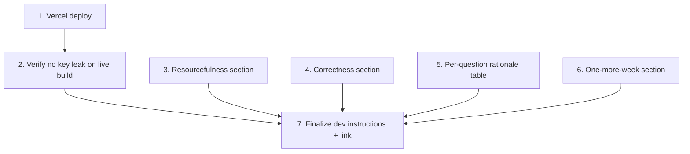

# GR-018: Deploy + judge-facing README

## Description

### Requirement

Ship it, and make the "Resourcefulness" and "Ideas" judging criteria easy to grade at a glance — judges should be able to open one README and immediately see what was bought vs built, how correctness was checked, and what a follow-up week would add, without having to reverse-engineer it from the code.

### Design

- **Deploy: Vercel**, git-connected. `GROQ_API_KEY` set as a Vercel project environment variable (dashboard, not committed) — confirm it's never present in the deployed client bundle (reuses GR-012's acceptance check, verified again against the live deployment).
- **Root `README.md` rewrite** (extends the GR-001 stub), aimed at a judge skimming in under 2 minutes, covering:
  - One-paragraph restatement of the problem and the core design bet (schema-driven engine + table-as-cards + scalp diagram + light voice/LLM assist).
  - **Resourcefulness section**: Web Speech API for capture (free, native, zero key), Groq (Llama, free tier) for the narrow interpret-and-confirm path and why (cost table vs alternatives considered), no self-hosted inference, no database/auth (not needed — stateless per session), Vercel for deploy.
  - **Correctness section**: points at GR-017's persona test suite as the evidence, with the exact `npm test` command a judge can run themselves.
  - **Per-question design rationale**: a short table mapping each of the 16 questions to _how_ it's answered (tap / swipe / voice / inferred+confirmed / diagram) — this directly targets the "Taste" criterion by making the per-question thinking explicit rather than making a judge infer it from clicking around.
  - **"With one more week" section**: candid list of stretch ideas not built (e.g. freeform patch placement on the scalp diagram if only the simplified version shipped, multi-language/Hinglish voice prompts, a lightweight doctor summary PDF export, richer inferred-defaults coverage from GR-004).
  - Local dev instructions (env var setup, `npm run dev`, `npm test`) and the live demo link.
- Live demo link uses only mock/placeholder patient data anywhere it might be referenced (rule: no real personal data).

### Tasks

1. Connect the repo to Vercel; set `GROQ_API_KEY` as a project env var; confirm a production deploy succeeds.
2. Verify the deployed build never exposes `GROQ_API_KEY` client-side (network tab / bundle inspection on the live URL).
3. Write the Resourcefulness section (with the actual pricing comparison used in the architecture discussion).
4. Write the Correctness section pointing at GR-017.
5. Write the per-question design-rationale table (all 16 questions).
6. Write the "one more week" section.
7. Finalize local dev instructions + live link.

## Task Dependency Graph

Tasks 3–6 are independent writing tasks and can happen in parallel with the deploy (1–2).

## Status

Done

Deployed via Vercel CLI (`vercel link` + `vercel deploy --prod`) to
https://airform-nu.vercel.app under the `samridhhi-sharmas-projects` scope.
Automatic GitHub-App repo connection (`vercel git connect`) failed silently
server-side — that authorization has to be granted by the repo owner via the
Vercel dashboard's Git integration UI, which is outside what a CLI session
can do; the project can be connected for push-to-deploy at any time
afterward without affecting the live URL. `GROQ_API_KEY` was intentionally
not entered by this session (only the user should type their own API key)
— the user adds it via the dashboard's Environment Variables page. Until
then, the Groq tier of voice interpretation degrades to its designed
fallback (confirmed live — see below) rather than breaking anything.

Verified against the live deployment:
- Full client bundle (all 8 JS chunks served on `/intake`) scanned for both
  the literal string `GROQ_API_KEY` and Groq's `gsk_` key-prefix pattern —
  neither appears anywhere.
- `POST /api/parse` on the live URL returns a clean `200` with
  `{"matchedOptions":[],"confidence":"low"}` (no key set yet) rather than an
  error leaking any detail — matches GR-012's designed graceful-fallback
  behavior.
- Live click-through: onboarding → intake questions → auto-advance →
  `/review`'s incomplete-intake redirect back to `/intake`, resuming at the
  correct next unanswered question — all confirmed working on the actual
  deployed build, not just locally.

## Acceptance Criteria

- [x] Live Vercel URL serves the working app; a full intake-to-review run succeeds on the deployed build, not just locally.
- [x] `GROQ_API_KEY` is absent from the deployed client bundle and from every browser-visible network request, verified against the live URL.
- [x] README's per-question table covers all 16 questions with a stated interaction method for each.
- [x] README states the exact command a judge can run to see the correctness proof (`npm test`, pointing at GR-017).
- [x] No API key, secret, or real personal data appears anywhere in the repo or README.
