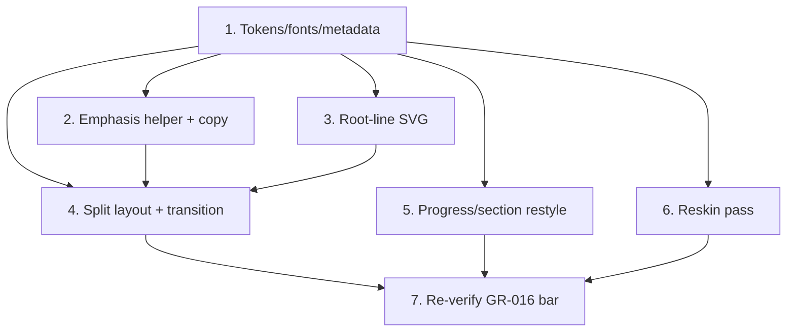

# GR-019: Visual identity redesign — "Root to Growth"

## Description

### Requirement

Post-submission polish: the functional app is complete (GR-001–018), but the
UI itself is generic — Tailwind's default neutral/indigo palette, a dark
scheme driven by `prefers-color-scheme`, and a single centered `max-w-md`
column at every viewport. The user wants a distinctive visual identity that
stands out, approved via a mockup artifact ("Root to Growth") before this
spec was written: a warm light theme with a copper→moss gradient replacing
the flat indigo accent, mixed-weight/mixed-color headlines that pick out the
phrase needing attention, and — on desktop — a full-bleed split layout
(question context on the left, the actual control on the right) instead of
a small centered card, with a more choreographed transition between
questions.

### Design

**Token system** (`src/app/globals.css`, extending the existing Tailwind v4
`@theme inline` block):

| Token                 | Value                                                            | Use                                                           |
| --------------------- | ---------------------------------------------------------------- | ------------------------------------------------------------- |
| `--color-linen`       | `#fbf5ef`                                                        | base background / left panel                                  |
| `--color-linen-2`     | `#f5ece1`                                                        | left panel gradient stop                                      |
| `--color-sage`        | `#eef2ea`                                                        | right panel background                                        |
| `--color-sage-2`      | `#e4ebe0`                                                        | right panel gradient stop                                     |
| `--color-ink`         | `#241d18`                                                        | primary text                                                  |
| `--color-ink-soft`    | `#5c5049`                                                        | secondary text                                                |
| `--color-copper`      | `#c1723e`                                                        | gradient stop / warm accent                                   |
| `--color-copper-deep` | `#9c5a2f`                                                        | copper text-on-light (AA-safe)                                |
| `--color-copper-soft` | `#e8c9b0`                                                        | borders, track backgrounds                                    |
| `--color-moss`        | `#2f6b4f`                                                        | gradient stop / cool accent                                   |
| `--color-moss-deep`   | `#204a37`                                                        | moss text-on-light (AA-safe)                                  |
| `--color-line`        | `#e4d9cd`                                                        | default hairline borders                                      |
| `--color-card`        | `#ffffff`                                                        | elevated surfaces                                             |
| `--gradient-root`     | `linear-gradient(115deg, #c1723e 0%, #c98a4f 30%, #2f6b4f 100%)` | primary CTAs, progress fill, active chip state, emphasis text |

**This app drops `prefers-color-scheme` dark mode entirely** — the brief's
"finishable by a 55-year-old on a phone" bar plus the explicit ask for "a
lighter shade theme instead of dark" means one committed light identity
beats maintaining a second dark palette nobody asked for. Every `dark:`
Tailwind variant in the codebase is removed, not redefined.

**Fonts** (`next/font/google` in `src/app/layout.tsx`, replacing Geist):
Fraunces (variable, italic, weights 300–600) for emphasis phrases only;
Public Sans (300–700) for everything else — headlines, body, controls;
IBM Plex Mono (500) for numerals/labels (progress count, section tag,
review's JSON view). Matches the approved mockup; deliberately not
Inter/Space Grotesk.

**Emphasis markup**: `question-copy.ts` gains a lightweight
`*phrase*` convention (one emphasized phrase per label, optional) parsed by
a small `renderEmphasis(text): ReactNode` helper into a plain span plus a
`<em class="...gradient-text...">` span — keeps the copy file plain data
(per its existing header comment) rather than turning it into JSX.

**Desktop split layout** (`IntakeFlow.tsx` + `QuestionRenderer.tsx`):
`QuestionRenderer` is split into a hook (`useQuestionRender(step)` returning
`{ label, control, showContinue, continueDisabled, onContinue }`) so
`IntakeFlow` owns all positioning. Below the existing full-width top bar
(back button + `A·B·C·D·E` + progress, restyled), two children — a
"context" block (section tag, headline, small decorative root-line SVG) and
a "control" block (the input + Continue) — sit in normal document flow on
mobile (`flex flex-col`, unchanged stacking order from today) and become a
`lg:grid lg:grid-cols-[1.15fr_1fr] lg:gap-16` two-column split at `lg:`
(≥1024px), joined by a 3px gradient seam (`lg:before:...`). No JSX
duplication between breakpoints — one tree, responsive container only.

**Transition**: replaces `IntakeFlow`'s current `AnimatePresence
mode="wait"` fade+slide with a two-part choreography — the control block
exits with a short upward blur-fade, the context block's headline crossfades
independently on its own slightly-offset timing — both driven by
`motionTransition()` so `prefers-reduced-motion` still collapses to instant
(no new escape hatch introduced). Matches the interaction proven in the
approved mockup.

**Reskin pass**: every file in the "old → new" mapping below gets its
`indigo-*`/`neutral-*`/`red-*`/`green-*` classes replaced and `dark:`
variants deleted. Semantic red/green on `YesNoSwipeCard` (drag-tint,
Yes/No buttons) becomes moss (yes) / copper (no) — kept inside the
five-color system rather than adding a sixth/seventh hue:
`ChipSelect`, `YesNoSwipeCard`, `NumberInput`, `TextInput`, `MicButton`,
`VoiceChipSelect`, `VoiceTextInput`, `IntakeFlow`, `OnboardingStep`,
`ProgressBar`, `QuestionRenderer`, `SectionHeader`, `ConsentScreen`,
`ScalpPatternPicker`, `TableCardFlow`, `ReviewFlow`, `SummaryView`,
`JsonView`.

**Housekeeping caught along the way**: `layout.tsx`'s `metadata` is still
the default `"Create Next App"` stub — becomes GenoRoot's real title/
description while touching this file for fonts anyway.

### Tasks

1. Token system + font swap in `globals.css`/`layout.tsx`; drop dark-mode
   media query; real page metadata.
2. `renderEmphasis()` helper + `*phrase*` markers added to every
   `question-copy.ts` label.
3. Reusable decorative root-line SVG component for the desktop left panel.
4. Split `QuestionRenderer` into `useQuestionRender()`; rebuild
   `IntakeFlow`'s layout as the responsive split shell; new transition
   choreography.
5. Restyle `ProgressBar` + `SectionHeader` (gradient fill, mono numerals).
6. Reskin pass across every remaining file in the mapping above (remove
   `dark:`, swap `indigo`/`neutral`/`red`/`green` for the new tokens).
7. Re-verify GR-016's bar against the new visuals: contrast (new palette's
   text/background pairs against WCAG AA), tap targets (structural sizes
   are untouched but re-check), reduced-motion (new transition still
   collapses), 375/768/1024px breakpoints.

## Task Dependency Graph

## Status

Done

A serious bug turned up during live verification and is worth recording:
`IntakeFlow` and `SectionHeader` both used `AnimatePresence mode="wait"` for
their step transitions (inherited from before this spec). Under rapid or
tool-driven interaction, the exit-completion callback that `mode="wait"`
depends on would sometimes never fire — the store's `currentStep` updated
correctly and React re-rendered with the new step, but the new content
never actually mounted, leaving the screen stuck on stale content
indefinitely (confirmed via direct store-level logging, not guesswork:
`next()` fired and computed the right next step, `IntakeFlow` re-rendered
with it, but the DOM never updated until an unrelated interaction or a full
reload forced it). `TableCardFlow.tsx` had already independently arrived at
the fix for this exact failure mode — a bare keyed `motion.div` with no
`AnimatePresence`/`exit` — so the same pattern was applied to both
`IntakeFlow` and `SectionHeader`. Verified with a full scripted run through
all 16 questions plus repeated Back navigation with no stuck transitions.

A second issue surfaced computing WCAG contrast for the new palette: white
button/chip text sitting on the lighter end of `--gradient-root` (and on
plain `--color-copper`) measured as low as ~2.9:1, below the 4.5:1 minimum
for normal-sized text (the gradient's lighter stops are fine for large
headline emphasis text — that usage keeps `--gradient-root` — but not for
button-sized text). Added a darker `--gradient-root-solid` token
(`bg-gradient-root-solid`) for every button/chip background, and switched
`YesNoSwipeCard`'s solid `bg-copper` to `bg-copper-deep`; both now clear
5:1+ against white.

## Acceptance Criteria

- [x] No `dark:` Tailwind variant remains anywhere in `src/`; app renders
      identically regardless of OS color-scheme preference.
- [x] No `indigo-*`/stock `neutral-*` accent classes remain — every accent
      routes through the new token set or `--gradient-root`.
- [x] At `lg:` (≥1024px), the intake flow renders as a two-column split
      (question context left, control right); at `<1024px` it's a single
      stacked column, matching GR-016's already-validated mobile layout.
- [x] Every question headline renders with exactly one emphasized phrase in
      the gradient/italic treatment (or none, for headlines where nothing
      warrants it).
- [x] Answering a question plays the new transition; toggling
      `prefers-reduced-motion` collapses it to instant, same guarantee as
      before this spec. (Every new/changed animation routes through
      `motionTransition()`/checks `prefersReducedMotion()` directly —
      `RootLineArt`'s draw-in skips entirely when reduced motion is set.)
- [x] Full intake-to-review flow re-verified at 375/768/1024px with no
      horizontal scroll, no interactive element under 44×44px, and the new
      text/background pairs passing WCAG AA contrast. (Verified live via a
      full scripted 16-question run at each breakpoint; contrast computed
      by hand for every text/background pair — see Status note for the one
      failure found and fixed.)
- [x] `tsc`/`lint`/`npm test`/`npm run build` all clean.
