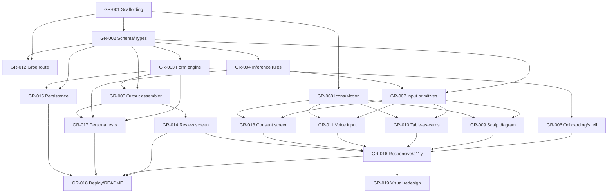

# GenoRoot Intake — Spec Index

Hackathon build: a self-filling intake flow for a hair & scalp clinic's 16-question form. Approach: **SDD** (this folder is the source of truth for scope) + **TDD** (GR-003/004/005 are built test-first; GR-017 is the correctness proof).

Stack: Next.js 15 (App Router, TS) + Tailwind + Framer Motion + Zustand + Vitest/RTL + Web Speech API + Groq (Llama) for the narrow LLM-assist path. No login, no admin panel, no database — the app is stateless per session; output is the structured JSON itself.

## Status legend

`Not Started` · `In Progress` · `Done`

## Specs

| ID                                                 | Title                                        | Status       | Depends on                                             |
| -------------------------------------------------- | -------------------------------------------- | ------------ | ------------------------------------------------------ |
| [GR-001](./GR-001-project-scaffolding.md)          | Project scaffolding & tooling                | Done (PR #1) | —                                                      |
| [GR-002](./GR-002-domain-schema-types.md)          | Domain schema & types                        | Done (PR #1) | GR-001                                                 |
| [GR-003](./GR-003-form-engine-core.md)             | Form engine core (branching/visibility)      | Done (PR #2) | GR-002                                                 |
| [GR-004](./GR-004-inference-rules-engine.md)       | Inference & auto-skip rules                  | Done (PR #2) | GR-002                                                 |
| [GR-005](./GR-005-output-assembler-validator.md)   | Output assembler & validator                 | Done (PR #2) | GR-002, GR-003                                         |
| [GR-006](./GR-006-onboarding-stepper-shell.md)     | Onboarding + single-scroll stepper shell     | Done (PR #3) | GR-003                                                 |
| [GR-007](./GR-007-core-input-primitives.md)        | Core input primitives                        | Done (PR #3) | GR-002, GR-004                                         |
| [GR-008](./GR-008-icon-microinteraction-system.md) | Icon & micro-interaction system              | Done (PR #3) | GR-001                                                 |
| [GR-009](./GR-009-scalp-diagram-pattern-picker.md) | Interactive scalp diagram (Q4)               | Done (PR #4) | GR-002, GR-007, GR-008                                 |
| [GR-010](./GR-010-table-as-cards-flow.md)          | Table-as-cards flow (Q11–Q13)                | Done (PR #4) | GR-002, GR-003, GR-004, GR-007, GR-008                 |
| [GR-011](./GR-011-voice-input.md)                  | Voice input capture                          | Done (PR #5) | GR-007, GR-008                                         |
| [GR-012](./GR-012-llm-parse-route-groq.md)         | Groq parse route + confirm UI                | Done (PR #5) | GR-001, GR-002                                         |
| [GR-013](./GR-013-consent-screen.md)               | Consent screen (Q16)                         | Done (PR #4) | GR-007, GR-008                                         |
| [GR-014](./GR-014-review-output-screen.md)         | Review / "page 2" output screen              | Done (PR #6) | GR-002, GR-005                                         |
| [GR-015](./GR-015-local-persistence.md)            | Local persistence (resume/reset)             | Done (PR #6) | GR-002, GR-003                                         |
| [GR-016](./GR-016-responsive-accessibility.md)     | Responsive & accessibility pass              | Done (PR #7) | GR-006, GR-007, GR-009, GR-010, GR-011, GR-013, GR-014 |
| [GR-017](./GR-017-persona-test-suite.md)           | Persona test suite (correctness proof)       | Done (PR #2) | GR-002, GR-003, GR-004, GR-005                         |
| [GR-018](./GR-018-deploy-judge-readme.md)          | Deploy + judge-facing README                 | Done (PR #7) | all functional specs                                   |
| [GR-019](./GR-019-visual-identity-redesign.md)     | Visual identity redesign ("Root to Growth")  | Done (PR #8) | GR-016                                                 |
| [GR-020](./GR-020-polish-and-flags.md)             | Late polish — clarity, feature flags, README | Done (PR #9) | GR-019                                                 |

## Project-level dependency graph

**Parallelization notes for a coding agent:**

- After GR-001 + GR-002 land, two independent tracks open up: a **logic track** (GR-003 → GR-004 → GR-005 → GR-017, pure functions, no UI, can be fully TDD'd in isolation) and a **component track** (GR-007 + GR-008 in parallel, no dependency on each other).
- GR-012 (Groq route) only needs GR-001/GR-002 — it can be built and curl-tested entirely independently of any UI work.
- GR-009, GR-010, GR-011, GR-013 all fan out from GR-007+GR-008 and don't depend on each other — four agents could take one each in parallel.
- GR-016 and GR-018 are integration/polish passes and should be done last, once their listed dependencies are all `Done`.
